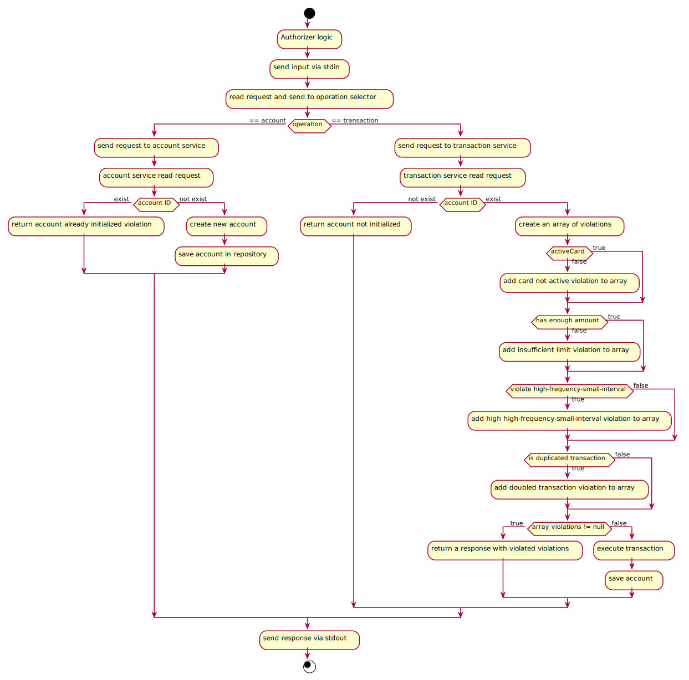

# Authorizer application

## Code challenge of Nubank

This application is in charge of authorizing the transactions in the accounts.

## Discussing regarding the technical and architectural decisions

For my solution I chose the **Go language** because I feel comfortable with it. It's a very powerful and performant 
language. It's also very good when it comes to implementing microservices.

I chose to apply an **hexagonal architecture** (a.k.a. DDD or Domain-Driven Design) because I've been working with this 
architecture for 2+ years, and I think if it is well applied it gives solutions that scale correctly and each layer has its
own logic and responsibilities well separated from the rest. All of this together prevents possible bad practices (e.g. spaghetti code) 
and if in the future changing a component, it's very easy to do. 

## Reasoning about the frameworks used (if any framework/library was used)

I didn't use any extra framework for my solution, I used built-in libraries except for [zap logger](https://github.com/uber-go/zap) 
(logger of Uber) because this library is a logger with steroids. Anyway I've created a [wrapper](./pkg/log/log.go) to avoid adding external 
dependencies or libraries to my core application, and in the future if I want to change my logger I only have to modify my pkg.

I used **[Go modules](https://go.dev/blog/using-go-modules)** to manage my dependencies. 

## How to compile and run the project

#### Requirements

- Go 1.15
- Operations file to send via stdin

#### Run

##### Run in your computer

- Unzip the zip file in $GOPATH/src/github.com/mbravovaisma/
- If it's your first running, you must download the dependencies. Run at the root project:

```
-> go mod download
```

- To run main package:

``` 
-> go run main.go < {your_operations_file} 
```

##### Run with docker

- Build a docker image

```
-> docker build -t authorizer .
```

- Run the image in interactive mode

```
-> docker run -i authorizer
```

- You can start the application running `go run main.go` and then start sending the operations one by one from the console
- Or you can load the operation files in the root of the project, run the docker commands again and then we will have the ops files in the container. Just run `go run main.go < {file_name}` and watch the output.

## Additional comments

I did a diagram to show us graphically the flow of the application



I hope to meet your expectations and to have created a simple and elegant application.

Matias Bravo :wolf: